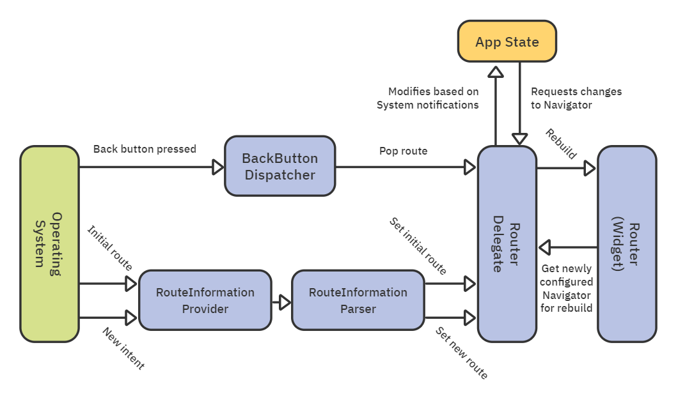

# 7. Routes & Navigation

## Navigator 2.0 overview

Flutter 1.22 introduced Navigator 2.0, a new declarative API that allows you to take full control of your navigation stack. It aims to feel more Flutter-like while solving the pain points of Navigator 1.0. Its main goals include:

**Exposing the navigator’s page stack**: You can now manage your pages. More power, more control!
**Backward-compatible with imperative API**: You can use both imperative and declarative styles in the same app.
**Handle operating system events**: Works better with events like the Android system’s Back button.
**Manage nested navigators**: Gives you control over which navigator has priority.
**Manage navigation state**: Lets you parse routes and handles web URLs and deep linking.

Here are the new abstractions that make up Navigator 2.0’s declarative API:

It includes the following key components:

**Page**: An abstract class that describes the configuration for a route.
**Router**: Handles configuring the list of pages the Navigator displays.
**RouterDelegate**: defines how the router listens for changes to the app state to rebuild the navigator’s configuration.
**RouteInformationProvider**: Provides RouteInformation to the router.
**RouteInformationParser**: Parses route information into a user-defined data type.
**BackButtonDispatcher**: Reports presses on the platform system’s Back button to the router.
**TransitionDelegate**: Decides how pages transition into and out of the screen.
